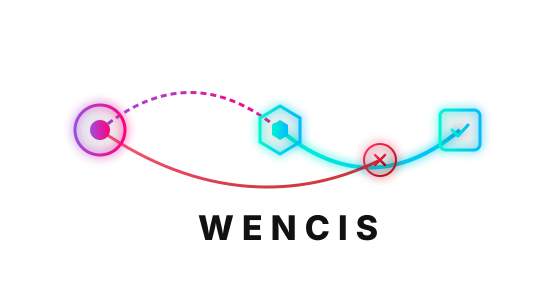

<p align="center">
  
</p>


# Wencis

> **The Cognitive Flight Recorder & Self-Improvement Engine for AI Agents.**

[](https://github.com/varsen/wencis)
[](https://opensource.org/licenses/Apache-2.0)
[](https://peps.python.org/pep-0561/)

Wencis is a production-ready async Python SDK that provides autonomous AI agents with causal reasoning tracing, trajectory optimization, draft response critiques, and meta-reasoning-guided self-improvement. It acts as both a debugger and a reinforcement-learning loop for agentic cognitive pipelines.

---

## 🚀 Key Capabilities

*   **Causal Debugging (Causal Graph)**: Track agent decisions, hypotheses, and facts as a directed graph. Trace failures back to their root-cause decisions in a structured traceback tree.
*   **Response Critic**: Intercept draft responses before they are shown to the user. Evaluate them programmatically on **Accuracy**, **Depth**, and **Honesty** using LLM critiques.
*   **Trajectory Optimizer**: Analyze historical agent runs. Revise step categories, compress verbose tool outputs to save tokens, and recombine (splice) successful trajectories at crossover points.
*   **Meta-Reasoning Engine**: Run Ordinary Least Squares (OLS) linear regressions on agent confidence metrics, aggregate tool failures, and auto-propose actionable system prompt adjustments.

---

## 📦 Installation

```bash
pip install wencis
```

---

## ⚡ Quick Start

Here is a complete, copy-pasteable example showing how to initialize the causal graph, log an agent's failure path, and query the traceback tree to isolate the root cause:

```python
import asyncio
from wencis import CausalKnowledgeGraph, SQLiteBackend

async def main():
    # 1. Connect to an async SQLite database (in-memory for demo)
    async with SQLiteBackend(":memory:") as backend:
        graph = CausalKnowledgeGraph(backend)

        # 2. Record an agent decision (e.g., executing a command)
        decision_id = await graph.register_observation(
            session_id="session-001",
            type="decision",
            content="Executing shell command: pip install requests",
            provenance="tool:bash",
        )
        print(f"Recorded decision: {decision_id}")

        # 3. Record an untested hypothesis triggered by that decision
        hypothesis_id = await graph.register_observation(
            session_id="session-001",
            type="hypothesis",
            content="requests will be successfully installed",
            provenance="reasoning:loop",
            parent_node_id=decision_id,
            edge_type="triggered_by",
        )

        # 4. Record a dead-end failure caused by the decision
        dead_end_id = await graph.register_observation(
            session_id="session-001",
            type="dead_end",
            content="ERROR: pip command not found (exit code 127)",
            provenance="tool:bash",
            parent_node_id=decision_id,
            edge_type="caused_failure_in",
        )
        print(f"Recorded failure: {dead_end_id}")

        # 5. Traceback from the failure node
        chain = await graph.query_traceback_tree(dead_end_id)
        print(f"\nCausal traceback tree ({len(chain)} nodes):")
        for node in chain:
            print(f"  depth={node['depth']} [{node['node_type'].upper()}] -> {node['content']}")

if __name__ == "__main__":
    asyncio.run(main())
```

---

## 🛠 Core Components & API Usage

### 1. Response Critic (Self-Correction)

The `ResponseCritic` evaluates draft agent responses against an internal LLM context. It enforces quality thresholds and checks for memory contradictions.

```python
from wencis import ResponseCritic

# Instantiate the critic with your LLM client
critic = ResponseCritic(llm_client)

response = await critic.critique(
    user_input="How do I set up transaction locks?",
    system_context="You are a database engineer assistant.",
    draft_response="You don't need locks. SQLite handles everything automatically.",
    draft_reasoning="Assume SQLite handles transaction safety implicitly.",
    memory_nodes=["SQLite transactions must use BEGIN IMMEDIATE to block concurrent writes."]
)

if not response.is_acceptable:
    print(f"Draft rejected: {response.feedback}")
```

### 2. Trajectory Optimizer (Fine-Tuning & Cleanup)

The `TrajectoryOptimizer` helps clean up verbose run logs to save tokens and optimize historical execution runs.

```python
from wencis import TrajectoryOptimizer

optimizer = TrajectoryOptimizer(backend, llm_client)

# Compress verbose outputs (>500 chars) using LLM summaries
await optimizer.run_refinement(trajectory_id="traj-123")

# Splice two successful trajectories at a crossover point to form a better run
new_traj_id = await optimizer.run_recombination(
    trajectory_id_1="traj-001",
    trajectory_id_2="traj-002"
)
```

### 3. Meta-Reasoning Engine (Self-Improvement)

The `MetaReasoningEngine` aggregates telemetry logs and fits confidence scores to an OLS regression line to identify if agent performance is decaying over time.

```python
from wencis import MetaReasoningEngine

engine = MetaReasoningEngine(llm_client, backend)

# Run OLS drift analysis & tool failure clustering to formulate improvement proposals
proposal = await engine.analyze_and_propose()

if proposal:
    print(f"System Adjustment proposed for: {proposal.target_system}")
    print(f"Description: {proposal.description}")
    print(f"Metric: {proposal.success_metric}")
```

---

## 🔌 Connecting AI Providers (LLM Client Adapters)

Wencis requires an object conforming to the `LLMClient` protocol (specifically containing a `complete_json` method) to power the Critic, Optimizer, and Meta-Reasoning modules. You can wrap your existing agent LLM client in a small adapter.

Here are copy-pasteable adapters for the top providers and models in 2026:

### 1. OpenAI / GPT-5.5
```python
from typing import Type, TypeVar
from pydantic import BaseModel
import openai

SchemaT = TypeVar("SchemaT", bound=BaseModel)

class OpenAIWencisClient:
    def __init__(self, api_key: str):
        self.client = openai.AsyncOpenAI(api_key=api_key)

    async def complete_json(
        self,
        *,
        schema: Type[SchemaT],
        system_prompt: str,
        user_input: str,
        temperature: float = 0.2,
    ) -> SchemaT:
        response = await self.client.beta.chat.completions.parse(
            model="gpt-5.5",
            messages=[
                {"role": "system", "content": system_prompt},
                {"role": "user", "content": user_input},
            ],
            response_format=schema,
            temperature=temperature,
        )
        return response.choices[0].message.parsed
```

### 2. Anthropic / Claude Sonnet 5
```python
from typing import Type, TypeVar
from pydantic import BaseModel
import anthropic

SchemaT = TypeVar("SchemaT", bound=BaseModel)

class AnthropicWencisClient:
    def __init__(self, api_key: str):
        self.client = anthropic.AsyncAnthropic(api_key=api_key)

    async def complete_json(
        self,
        *,
        schema: Type[SchemaT],
        system_prompt: str,
        user_input: str,
        temperature: float = 0.2,
    ) -> SchemaT:
        response = await self.client.messages.create(
            model="claude-sonnet-5",
            max_tokens=4000,
            temperature=temperature,
            system=system_prompt + "\nReturn ONLY raw JSON matching this schema: " + schema.model_json_schema(),
            messages=[{"role": "user", "content": user_input}],
        )
        return schema.model_validate_json(response.content[0].text)
```

### 3. DeepSeek / DeepSeek V4 Pro
```python
from typing import Type, TypeVar
from pydantic import BaseModel
import openai

SchemaT = TypeVar("SchemaT", bound=BaseModel)

class DeepSeekWencisClient:
    def __init__(self, api_key: str):
        self.client = openai.AsyncOpenAI(
            api_key=api_key,
            base_url="https://api.deepseek.com/v1"
        )

    async def complete_json(
        self,
        *,
        schema: Type[SchemaT],
        system_prompt: str,
        user_input: str,
        temperature: float = 0.2,
    ) -> SchemaT:
        response = await self.client.chat.completions.create(
            model="deepseek-v4-pro",
            messages=[
                {"role": "system", "content": system_prompt},
                {"role": "user", "content": user_input},
            ],
            response_format={"type": "json_object", "schema": schema.model_json_schema()},
            temperature=temperature,
        )
        return schema.model_validate_json(response.choices[0].message.content)
```

---

## 🛡 Security & Design Standards

*   **Cryptographic Verification**: Every epistemic node contains a SHA-256 integrity hash covering its `node_id`, `session_id`, `run_id`, `type`, `content`, `provenance`, `timestamp`, and `metadata`. Modifying any database parameter renders the node invalid under `verify_integrity()`.
*   **Task-Serialized Connection Lock**: SQLiteBackend uses reentrant asyncio locks combined with Task-ownership verification to guarantee absolute transaction isolation across concurrent tasks.

